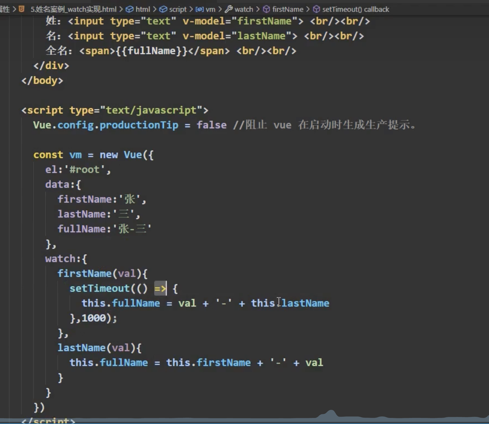
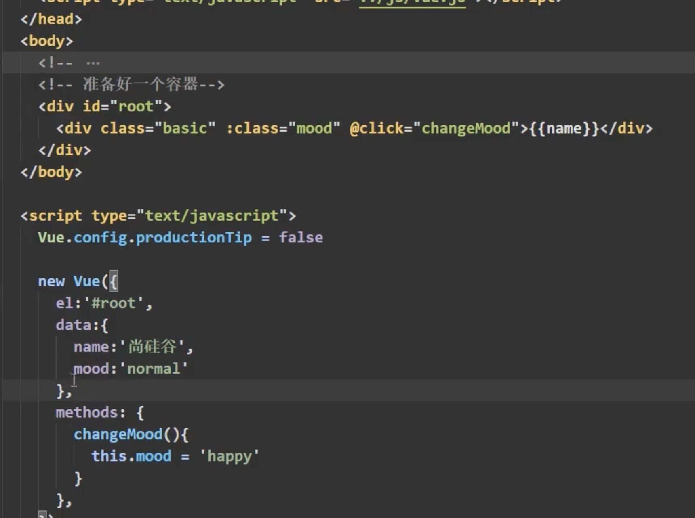
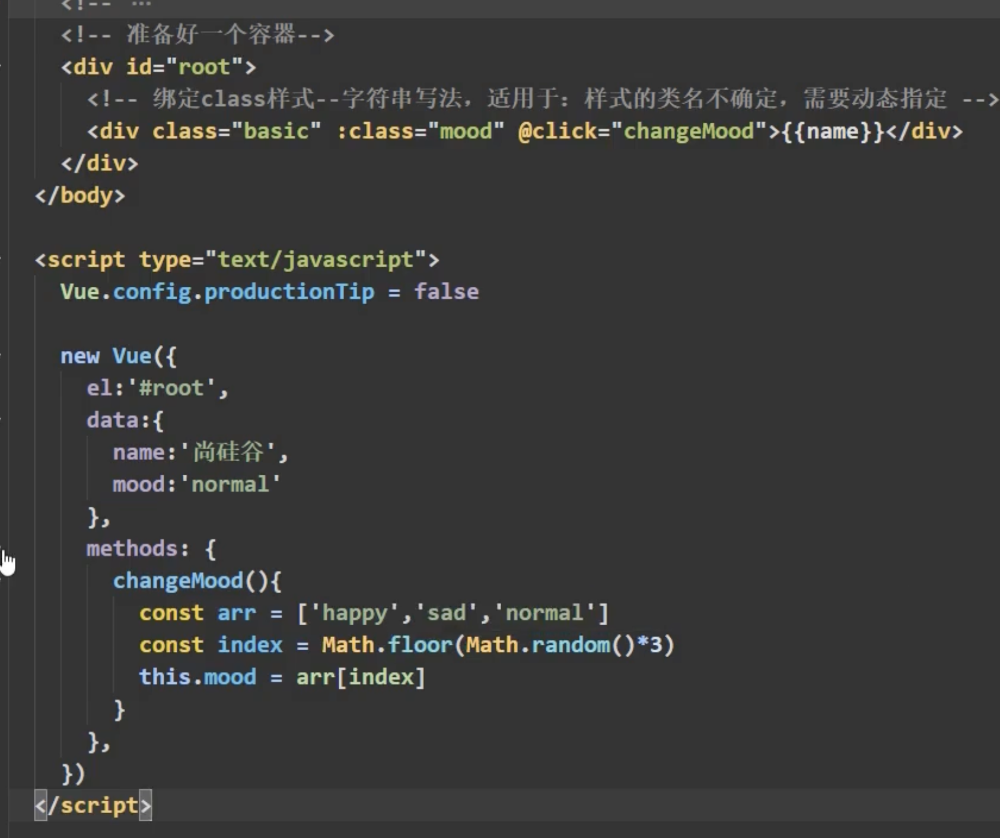
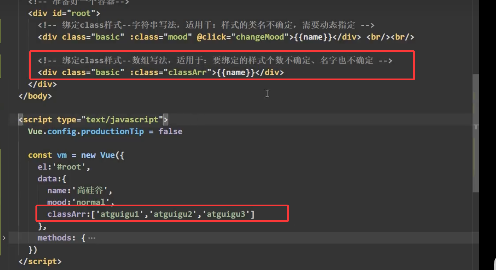
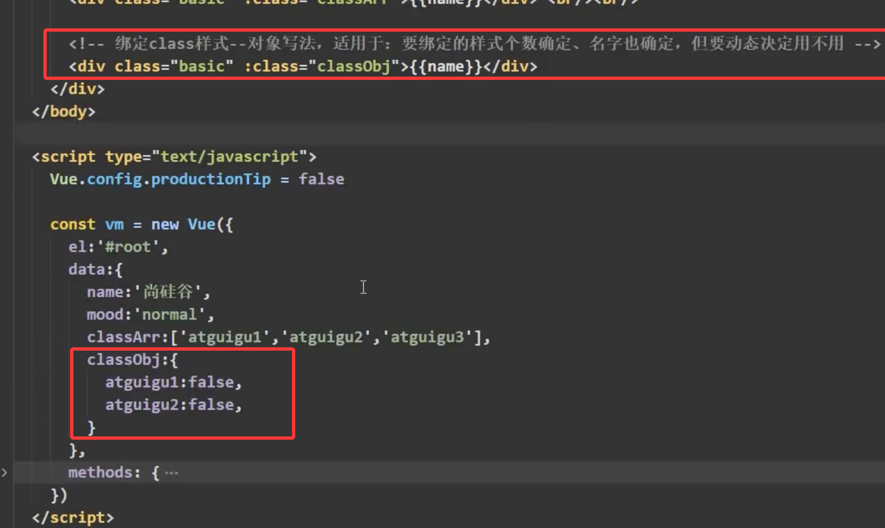
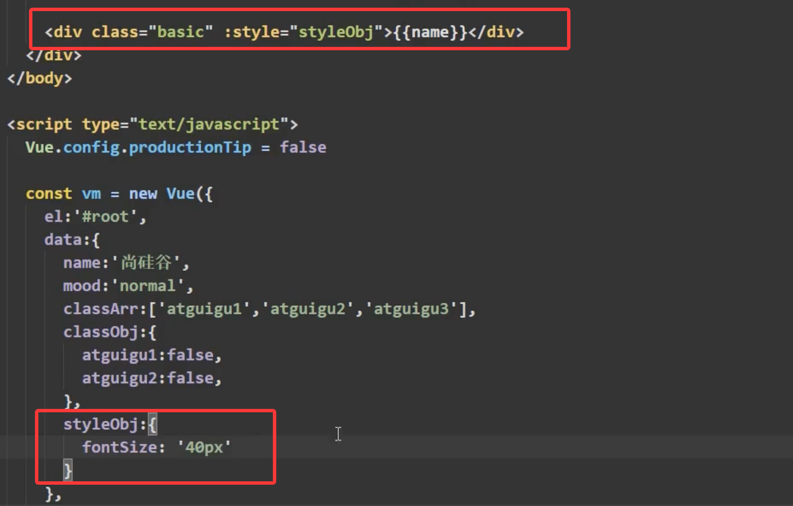

### vue
    vue的基础。。。需要自己去网上或者是b站尚硅谷上面进行去学，现在下面写的是比初级要强一点点。。
    如果在vscode中写vue的时候  建议安装插件名称为vue3.....  什么  什么的提示  挺好用的。

一旦data里面的数据发生变化  那么页面中用到该数据的会自动更新。

    {{这个里面必须要写js的表达式 例如  date.now()}}

    如果你想在标签体里面放内容  使用的是插值语法

    指令语法用于 使用  标签属性  标签体内容  绑定事件.......... vue中有很多指令  但是都是v-????

    v-bind 是单向绑定   v-model 是双向绑定  但是这个v-model只能用到表单类的元素上面，简单来说的话，要有value这个属性才可以。专业术语的话，v-bind  只能从data流向页面   而v-model是从data流向页面也能从页面流向data

    el和data的两种写法   先要把el注释掉 然后输入  const a = new vue({data:{name:'cxd'}})  a.$mount('#root')  第二种写法   data的第一种写法  就是前面的new vue({data:{name:'cxd'}})   第二种写法函数式写法()   data:function(){return {name:'cxd'}},这个function中的this是vue实例对象，可以输出试一下,还有一种简写的方式 data(){return {name:'cxd'}}  如果写成箭头函数的话  那里面的this 是win  例如 data:()=>{}

    mvvm  m是模型 对应的是data数据  v 视图 对应的是模版  vm 是vue的实例对象  使用vm进行接受变量  data中的所有属性 最后都出现在了vm身上   vm身上所有属性 及vue原型上所有属性 在vue模版中都可以直接使用。

    object.defineProperty方法  object.defineProperty(对象名称，'属性名称',{value:18})  然后在输入一下对象  对象里面你刚刚添加的属性名称是不能被枚举的意思是不参与遍历的  object.keys(对象名称)这个方法的意思是 keys()这个里面要传入一个对象作为一个参数 可以把这个对象里面所有属性的属性名称提取出来  变成一个数组 但是如果使用的defineProperty进行添加到这个keys()里面的话，是获取不到了，这个就是枚举  也可以使用for进行验证   如果想要遍历的话在object.defineProperty(对象名称，'属性名称',{value:18,enumerable:true}) 就可以了。如果在对象里面直接写入属性名称 在控制台里面是可以修改的 如果使用的是object.defineProperty(对象名称，'属性名称',{value:18，enumerable:true}) 的话 是修改不了的  如果想修改的话  在添加一个参数为 object.defineProperty(对象名称，'属性名称',{value:18，enumerable:true,writable:true}) 就可以在控制台中进行修改了 例如 对象名称.属性名称 = 19 如果想删掉的话正常的在控制台中输入  delete 对象名称.属性名称  就可以删掉了  如果使用的是defineProperty(对象名称，'属性名称',{value:18，enumerable:true,writable:true})这种方式进行添加的属性  是无法通过  delete 对象名称.属性名称  进行删除的 如果想要给他删除的话 加入属性为 defineProperty(对象名称，'属性名称',{value:18，enumerable:true,writable:true，configurable:true})  就可以删除了

    数据代理  意思是a对象里面有一个属性为x  b对象里面有个属性为y  想让d对象能操作a对象里面的一个属性为x，赋值，获取，修改
    ```
    let a = {x:100}
       let b = {y:200}
       Object.defineProperty(b,'x',{
        get(){
            return a.x
        },
        set(value){
            a.x = value
        }
       })
    ```
    具体实现与上面的步骤。

    vue中的数据代理 vue中  如果想在控制台中输入data这个属性的话   在代码中使用一个变量去接受它  然后在进行输入为  const vm = new vue({......})  然后在控制台中输入vm._data回车

### 下面是一些练习的东西
   ```
    name:'你好'
    hello {{name}}

    `<h1>`插值语法`</h1>`
    `<h3>`你好  {{name}}`</h3>`
    `<hr>`
    `<h1>`指令语法`</h1>`
    `<a :href="url.toUpperCase()">`点我去百度`</a>`
    `<a :href="school.name">`点我去百度`</a>`

    单向数据绑定`<input type="text" v-bind:value="name">`
    `<!-- 双向数据绑定  <input type="text" v-model:value="name"> -->`
    双向数据绑定的简写方式  `<input type="text" v-model="name">`
    new Vue({
        el:'#root',
        data:{
            name:'test'
        }
    })

    new Vue({
        el:'#root',
        data(){
            return{
                name:'cxd'
            }
        }
       })`<div id="root">`
     `<h1>`你好  {{name}}`</h1>`
    `</div>`

    let person = {
            name:'张三',
            sex:'男'
        }
   ```


### 事件处理   
    使用v-on:xxx或者是@xxx绑定事件 其中xxx是事件名称  事件的回调需要配置在methods对象中，最终会在vm上面  methods中的配置函数，不要用箭头函数 否则this就不是vue了  而是win   @click = 'demo'和@click = 'demo(参数1,$event)'  效果是一样的 但是后者可以传递参数。

    如果使用的是a标签，并且这个a标签的href也有一个地址，想在点击a标签的时候，不跳转次链接  使用的方式是 @click.prevent = '方法名称' 可以不跳转
    
    阻止冒泡 意思是div里面有个button   但是div有一个点击事件  button也有一个点击事件  点击button的时候，会输出或者是弹框两次  这个就是典型的冒泡  怎么处理  在button里面的@click.stop = '方法名称' 就可以阻止  
    
    事件只触发一次，就是页面上一个按钮或者是a标签  点击了一次  触发了事件，后续在点击的时候  希望是不在触发次事件了 使用的方式 在button或者是a标签中添加 @click.noce = '方法名称' 就可以实现了。

    捕获模式  意思是当冒泡事件被触发的前提是先执行的是捕获阶段 然后才是冒泡执行  如果要想处理捕获阶段操作的话  按照正常的逻辑来书 div2在div1里面 当我点击div2的click事件的时候 控制台输出或者是弹框 先输入的一定是div2里面的内容  然后在冒泡到div1里面  如果想转换一下  点击div2先要执行div1里面的内容然后在执行div2里面的内容的话  执行方法是    div1里面有click.capture = '方法名称（1）' div2里面有click = ‘方法名称（2）’（建议在方法执行的时候，传一些参数，可以很好的看到例子） 就可以先执行div1里面的东西 然后在执行div2里面东西

    只有event.target是当前操作元素的时候才能触发事件  在div中有个button  div有一个click事件  button也有一个click事件 正常来说的话点击button 会出现冒泡行为 在控制台中或者是弹框中输出两次button元素内容 但是div里面的click变成了click.self = '方法名称' 在进行点击button 只会输出一次button元素内容 调用同一个方法，方法名称一样

    passive这种事件的响应和用法 需要配合滚动条进行举例才能看明白 当你需要做移动端的项目给平板或者是手机用的 才能使用到

    事件处理也可以连着去写入  例如 配合a标签进行使用 herf里面有地址  这个a标签在div里面  但是div本身绑定了click事件  a标签也绑定了click事件  正常来说的话  点击a触发冒泡事件之后跳转成功之类的 我即想阻止冒泡也想不让跳转 语法是这么写的 click.stop.prevent = '方法名称' 即可实现

### 键盘实践
    配合input框进行操作  键盘事件一个叫keyup和keydown  两个的区别是后者你按下某一个按键不用抬起来会触发事件前者是你按下某一个按键需要抬起来才能触发事件 然后在配合方法进行使用或者是别的什么效果进行展示  需要拿到input里面的value 在方法中输入event.target.value就能拿到input里面的值  具体为 @keyup = '方法名称'  在js里面写入  方法名称(e){e.target.value}  e.keyCode这个属性是能看到按键编码 看一下你需要按键的编码 如果在vue中使用的话  具体为@keyup.enter  意思是点击回车才能触发方法里面的内容   例如 @keyup.enter = '方法名称' js中  方法名称(e){e.target.value}. 下面的别名都可以替换enter.  也可以先通过keyCode进行输出一个按键编码  然后在进行输入用  例如  @keyup.13 = '方法名称' 但是官网中显示未来已经放弃了 还是需要使用键盘名称进行使用 等等........  
    按键的别名为：
    1.Vue中常用的按键别名：
        口车=> enter
        删除 => delete（捕获“删除”和“退格”键）
        退出 => esc
        空格 => space
        换行 => tab   必须配合keydown进行使用
        上=>Wp
        下 => down
        左=> left
        右=> right
    3.系统修饰键（用法特）：ctrl、alt、shift、meta
        （1）.配合keyup使用：按下修饰键的同时，再按下其他键，随后释放其他键，事件才被触发。
        （2）.配合keydown使用：正常触发事件。
    4.也可以使用keyCode去指定具体的按键（不推荐）
    5.Vue.config.keyCodes.自定义键名= 键码，可以去定制按键别名  不太推荐

    如果要求我只有按ctrl.y同时按的时候，才能触发这个事件 使用方式@keyup.ctrl.y = '方法名称' 即可。

### 计算属性
    在双向绑定的到时候 要求是 在输入框中输入的数字和在其他标签显示的数字一样的时候，要求其他标签显示的位置只显示指定的位数 使用的方式1：data里面的数据名称.slice(0,3) 的意思是只获取这个数据的前三位 例如下面的代码

    ```
    <div id="root">
        姓: <input type="text" v-model="namex"><br><br>
        名:<input type="text" v-model="namem"><br><br>
        <span>全名：{{namex.slice(0,3) + '-' + namem}}</span>
    </div>
    <script src="vue.js"></script>
    <script>
        new Vue({
            el:'#root',
            data:{
                namex:'张',
                namem:'三'
            }
        })
    </script>
    ```
    如果想要精简这个大括号里面的表达式的书写方式  使用方法的方式进行精简插值语法 例如下面的代码  可能需要调整一下缩进 使用方法的方式进行展示
    ```
    <div id="root">
        姓: <input type="text" v-model="namex"><br><br>
        名:<input type="text" v-model="namem"><br><br>
        <span>全名：{{namexm()}}</span>
    </div>
    <script src="vue.js"></script>
    <script>
        new Vue({
            el:'#root',
            data:{
                namex:'张',
                namem:'三'
            },
            methods:{
                namexm(){
                    return this.namex + '-' + this.namem
                }
            }
        })
    </script>
    ```
    还有一种方式进行精简上面两种代码  使用计算属性的方式进行书写 计算属性的原理，定义：要用的属性是不存在的，要通过属性计算得来的 底层借助了object.defineproperty方法的getter和setter  get函数什么时候执行：1.初次读取的时候会执行一次。2.当依赖的数据发生变化的时候会再次被调用。优势和methods相比，内部有缓存机制，可以复用，效率更高，调试方便 。  计算属性最终会在Vm里面展示，可以执行读取和使用   如果计算属性被修改了，必须写上set函数去响应修改，且set中要引起计算时依赖的数据发生变化。解释一下在控制台中去修改vm里面的属性的时候  例如vm.namex = '什么什么' 点击回车  页面的属性同步发生变化。
    展示下面代码：

    ```
    <div id="root">
        姓: <input type="text" v-model="namex"><br><br>
        名:<input type="text" v-model="namem"><br><br>
        <span>全名：{{namexm}}</span>
    </div>
    <script src="vue.js"></script>
    <script>
        new Vue({
            el:'#root',
            data:{
                namex:'张',
                namem:'三'
            },
            computed:{
                namexm:{
                    // get 有什么作用 当有人读取namexm的时候，get就会被执行，且返回值为namexm的值
                    // get 什么时候被嗲用  1.初次读取namexm的时候。2.所依赖的数据发生变化的时候
                    get(){
                        return this.namex + '-' + this.namem
                    },
                    // set什么时候被调用  namexm被修改的时候
                    set(value){
                        const arr = value.split('-')
                        this.namex = arr[0]
                        this.namem = arr[1]
                    }
                }
            }
        })
    </script>
    ```

    计算属性简写方式  这种的简写方式只考虑读取不考虑修改的时候(只考虑获取不考虑读取的到时候)  使用的是这种简写方式 代码为：
    computed:{
        namexm(){
            return this.namex + '-' + this.namem
        }
    }

### 监视属性
    创建案例 使用案例里面的效果进行实现功能 有很多种写法  第一种写法三元表达式

<div id="root">
        <h2>今天的天气{{isHot ? '炎热' : '凉爽'}}</h2>
        <button>切换天气</button>
    </div>
    
<script src="vue.js"></script>
<script>
        new Vue({
            el:'#root',
            data:{
                isHot:true
            }
        })
</script>

    第二种写法 使用计算属性进行展示

<div id="root">
        <h2>今天的天气{{info}}</h2>
        <button @click = 'qhinfo'>切换天气</button>
    </div> 
    
    <script src="vue.js"></script>
    <script>
        new Vue({
            el:'#root',
            data:{
                isHot:true
            },
            computed:{
                info(){
                    return this.isHot ? '炎热' : '凉爽' 
                }
            },
            methods:{
                qhinfo(){
                    this.isHot = !this.isHot
                }
            }
            
        })
    </script>

    第三种写法在事件当中直接进行修改 如果你代码中写的事件只做一件事情的话 可以这么写  但是如果做的事情比较多的话  这么写有点长 需要和计算属性进行配合  computed和methods 这两个属性进行配合使用  如果实现点击切换天气弹窗的换  如果直接在click=‘在这个里面去写的话，会报错’ 例如  click = 'alert(1)'控制台会报错 x做了一个累加的操作。
    绑定事件的时候：@xxx = 'yyy' 这个yyy可以写一些简单的语句。

<div id="root">
        <h2>今天的天气{{info}},{{x}}</h2>
        <button @click = 'isHot = !sHot;x++'>切换天气</button>
    </div> 
    
    <script src="vue.js"></script>
    <script>
        new Vue({
            el:'#root',
            data:{
                isHot:true,
                x:1
            },
            computed:{
                info(){
                    return this.isHot ? '炎热' : '凉爽' 
                }
            },
            methods:{
                // qhinfo(){
                //     this.isHot = !this.isHot
                // }
            }
            
        })
    </script>

    监视属性的写法  watch 能监视正常属性 也能监视计算属性 watch的两种写法  什么时候使用这两种写法 这两种写法的使用场景  第一种如果你很明确知道我要监视谁的话，使用第一种   如果你开始不知道监视谁，后续才知道我要监视它，使用第二种写法方式。下面代码展示为：

<div id="root">
        <h2>今天的天气{{info}}</h2>
        <button @click = 'isHot = !sHot'>切换天气</button>
    </div> 
    
    <script src="vue.js"></script>
    <script>
        const vm = new Vue({
            el:'#root',
            data:{
                isHot:true
            },
            computed:{
                info(){
                    return this.isHot ? '炎热' : '凉爽' 
                }
            },
            methods:{
                qhinfo(){
                    this.isHot = !this.isHot
                }
            },
            // 第一种方式写法  
            watch:{
                isHot:{
                    // immediate的作用是初始化的时候，让handler自动调用一下
                    immediate:true,
                    // handler 什么时候调用呢？  当isHot发生变化的时候调用 newValue,oldVaule  前者是新的值  后者是旧的值
                    handler(newValue,oldVaule){
                        console.log(newValue,oldVaule)
                    }
                }
            }

        })
        // 第二种方式写法
        vm.$watch('isHot',{
            // immediate的作用是初始化的时候，让handler自动调用一下
            immediate:true,
            // handler 什么时候调用呢？  当isHot发生变化的时候调用 newValue,oldVaule  前者是新的值  后者是旧的值
            handler(newValue,oldVaule){
                console.log(newValue,oldVaule)
            }
        })
    </script>

### 深度监视
    vue中的watch默认不监视对象内部值的改变(一层)  如果在watch中配置deep:true就可以检测对象内部值的变化  但是vue自身也能监测到对象内部的变化 但是vue中的watch默认是不开启的  使用watch的时候根据数据的具体结构，在进行决定是否采用这个深度监视。下面是深度监视的具体代码：主要的是numbers东西的变化

<div id="root">
        <h2>今天的天气{{info}}</h2>
        <button @click = 'isHot = !sHot'>切换天气</button>
        <hr>
        <h3>a的数据是：{{numbers.a}}</h3>
        <button @click = 'numbers.a++'>点我加一</button>
    </div> 
    
    <script src="vue.js"></script>
    <script>
        const vm = new Vue({
            el:'#root',
            data:{
                isHot:true,
                numbers:{
                    a:1,
                    b:2
                }
            },
            computed:{
                info(){
                    return this.isHot ? '炎热' : '凉爽' 
                }
            },
            methods:{
                qhinfo(){
                    this.isHot = !this.isHot
                }
            },
            
            watch:{
                isHot:{
                    // handler 什么时候调用呢？  当isHot发生变化的时候调用 newValue,oldVaule  前者是新的值  后者是旧的值
                    handler(newValue,oldVaule){
                        console.log(newValue,oldVaule)
                    }
                },
                //监视多级结构中某个属性的变化
                'numbers.a':{
                    handler(){
                        console.log('监视成功')
                    }
                },
                //监视多级结构中所有属性的变化
                numbers:{
                    deep:true,
                    handler(){
                        console.log('只要是a或者是b其中一个修改了变化，都会触发这句话的输出')
                    }
                }

            }

        })
    </script>

### 监视属性简写的形式和写法
    如果你要使用immediate或者是deep的时候 就不能简写  如果不使用的情况下  代码简写形式为：

<div id="root">
        <h2>今天的天气{{info}}</h2>
        <button @click = 'isHot = !sHot'>切换天气</button>
    </div> 
    
    <script src="vue.js"></script>
    <script>
        const vm = new Vue({
            el:'#root',
            data:{
                isHot:true
            },
            computed:{
                info(){
                    return this.isHot ? '炎热' : '凉爽' 
                }
            },
            methods:{
                qhinfo(){
                    this.isHot = !this.isHot
                }
            },
            // 第一种简写写法
            watch:{
                isHot(newValue,oldVaule){
                    console.log(newValue,oldVaule)
                    
                },
            }
        })
        // 第二种简写写法  不允许写成箭头函数，会造成this指向有问题
        vm.$watch('isHot',function(){
            console.log(newValue,oldVaule)
        })
    </script>

### 计算属性和监视属性的区别
    官网上显示的是，前者要比后者使用的更加流畅；  如果需求是当官网里面的姓发生变化的时候，姓名延迟一秒在发生变化，如果是这种情况的话，使用后者比较好。在指定的属性方法里面添加settimeout(()=>{要执行的操作},1000) 意思是等一秒钟在执行里面具体代码的操作。 后者是可以开启异步任务 但是前者是不行的。具体实现为：

    前者能完成的功能，后者一定也能完成 ，但是后者能完成的 前者不一定也能完成，例如上面的异步操作

### 绑定样式（下面的图片或者是代码 需要自己创建class样式）一定要严格的按照下面的照片进行书写
    绑定class样式写法，字符串写法，适用于场景为：样式的类名称不确定，需要动态指定，代码如下：

    js中的随机数和把生成的随机数取整写法：math.floor(math.random()*3)  意思是随机数0-2之间向下取整。下面照片里面的代码实现的是生成随机数进行实现的

    绑定calss样式 数组写法 现在的需求是 页面有个div style里面有三个样式  要求是页面上面的div显示的样式第一次点击的时候 让style里面的三个样式随机显示 也有可能一个样式也没有 下面图片里面的代码是具体实现(绑定class样式 数组写法，样式的类名称不确定，需要动态指定) 适用于场景为：要绑定的样式个数不确定，名称也不确定：

    绑定class样式  对象写法 适用于 要绑定的样式个数确定，名字确定，但是动态决定用不用

    如果使用内敛样式的对象写法 使用下面的方式进行操作：


### 条件渲染
    中如果你要求显示的标签有很高的显示频率建议使用 v-show（打开F12是可以在里面看到的标签） 频率底建议使用 v-if 两者的明显的区别在于 style中v-show是显示与隐藏而v-if（打开F12标签已经不在了）是直接把标签干掉  而v-elif和js里面的if else 使用的方式是一样的
    如果在标签中单独写一个v-else 意思是如果上面的if里面的条件都不成立的话，执行v-else里面的东西。但是有一点 v-if和v-esle-if(v-elif) 是一个整体不能打断如果打断了，后面的代码就没有用了。  还有一个标签显示template 如果使用这个标签里面在进行包裹其他的标签在运行的话，F12里面是不显示这个标签的，而且这个标签只能和v-if进行使用。  

### 列表渲染
    v-for 具体代码在vue.html里面展示  使用index作为key和使用id作为key的区别(在页面中使用index作为key在页面中添加到列表的最后一条数据的时候 是没有什么太大的问题，但是如果index作为key来使用并且在列表中的插入第一条数据的时候会出现问题，列表配合input能展示出问题所在，如果使用id作为key的话并且在列表中插入第一条数据的时候，就不会出问题) 表示如果使用index作为key可能会引起的问题是：若对数据进行：逆向添加，逆序删除等破坏顺序操作，会产生没有必要的真实DOM更新 ==> 界面效果没有问题，但是效率低。如果结果中还包含输入类的DOM会产生错误DOM更新 ==> 界面有问题  

    如果没有指定key的话 vue默认给你使用的是index
    
    在开发中如何使用key：
        1.最好使用每条数据的唯一标识作为key，例如id，手机号，身份证号，学号等唯一值。
        2.如果不存在对数据的逆序添加，逆序删除等破坏顺序操作，仅用于渲染列表用于展示，使用index作为key是没有问题的
    使用index作为key

    ```
    <div id="root">
        <button @click="add">添加一条数据</button>
        <ul>
            <li v-for="(l,index) in list" :key="index" >
                {{l.name}}--{{l.age}}
                <input type="text">
            </li>
        </ul>
    </div>

    <script src="vue.js"></script>
    <script>
        new Vue({
            el:'#root',
            data:{
                list:[
                    {id:'001',name:'张三0',age:18},
                    {id:'002',name:'张三1',age:40},
                    {id:'003',name:'张三2',age:34}
                ]
            },
            methods: {
                add(){
                    const add1 = {id:'004',name:'张三3',age:50}
                    this.list.unshift(add1)
                }
            },
        })
    </script>
    ```

    使用id作为key

    ```
     <div id="root">
        <button @click="add">添加一条数据</button>
        <ul>
            <li v-for="(l,index) in list" :key="l.id" >
                {{l.name}}--{{l.age}}
                <input type="text">
            </li>
        </ul>
    </div>

    <script src="vue.js"></script>
    <script>
        new Vue({
            el:'#root',
            data:{
                list:[
                    {id:'001',name:'张三0',age:18},
                    {id:'002',name:'张三1',age:40},
                    {id:'003',name:'张三2',age:34}
                ]
            },
            methods: {
                add(){
                    const add1 = {id:'004',name:'张三3',age:50}
                    this.list.unshift(add1)
                }
            },
        })
    </script>
    ```

### 列表过滤 (下面的代码展示 如果监视属性和计算属性都能实现的情况下 优先使用计算属性)
    使用监听属性实现的：
    ```
      <div id="root">
        <h2>数据筛选</h2>
        <input type="text" placeholder="请输入姓名" v-model="keyname">
        <ul>
            <li v-for="(l,index) in flist" :key="l.id">
                {{l.name}}------{{l.age}}------{{l.sex}}
            </li>
        </ul>
    </div>

    <script src="vue.js"></script>
    <script>
    Vue.config.productionTip = false
    
    new Vue({
        el:'#root',
        data:{
            keyname:'',
            list:[
                {id:'001',name:'谭松韵',age:'20',sex:'女'},
                {id:'002',name:'布吉岛',age:'23',sex:'女'},
                {id:'003',name:'沈腾1',age:'24',sex:'男'},
                {id:'004',name:'复航2',age:'24',sex:'男'}
            ],
            flist:[]
        },
        watch:{
            // keyname(val){
            //     this.flist = this.list.filter((l)=>{
            //         return l.name.indexOf(val) !== -1
            //     })
            // }
            keyname:{
                immediate:true,
                handler(val){
                     this.flist = this.list.filter((l)=>{
                     return l.name.indexOf(val) !== -1
                 })
                }
            }
        }
    })
    </script>
    ```
    使用计算属性实现的：
    ```
     <div id="root">
        <h2>数据筛选</h2>
        <input type="text" placeholder="请输入姓名" v-model="keyname">
        <ul>
            <li v-for="(l,index) in lists" :key="l.id">
                {{l.name}}------{{l.age}}------{{l.sex}}
            </li>
        </ul>
    </div>

    <script src="vue.js"></script>
    <script>
    Vue.config.productionTip = false
    
    new Vue({
        el:'#root',
        data:{
            keyname:'',
            list:[
                {id:'001',name:'谭松韵',age:'20',sex:'女'},
                {id:'002',name:'布吉岛',age:'23',sex:'女'},
                {id:'003',name:'沈腾1',age:'24',sex:'男'},
                {id:'004',name:'复航2',age:'24',sex:'男'}
            ]
        },
        computed:{
            lists(){
                return this.list.filter((l)=>{
                    return l.name.indexOf(this.keyname) !== -1
                })
            }
        }
    })
    </script>
    ```
### 列表排序
    
